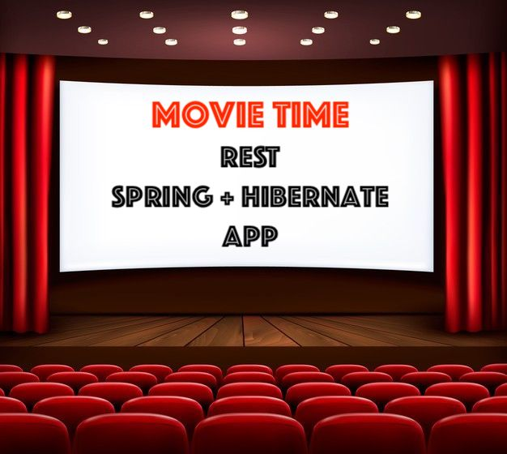

##  Description
A server application that implements the logic of the service for booking based on **Hibernate** and **Spring** frameworks using **REST** common principles.

---

##  Project structure
Project based on Three-Tier architecture:
- **Presentation tier** (controllers) - provides user interaction with the application
- **Logic tier** (services) - establishes the set of available operations and coordinates the program's response to each operation.
- **Data tier** (DAO) - represents interaction with the database

---

## Features
- register (the user will be assigned the USER role)
- login as a USER
- login as an ADMIN (you can use existing account)

*Depending on the role of the authenticated user, the following functions are available:*

_For users with USER role:_
- find Movies and CinemaHalls
- find available MovieSessions
- creating shopping cart
- add tickets to shopping cart
- view their shopping cart
- complete an order
- view order history

_For users with ADMIN role:_
- create and find Movies and CinemaHalls
- create and find available MovieSessions
- find user by email

---

## Technologies
- Java 11
- Maven 4
- MySQL 8
- Hibernate 5.4.27
- Hibernate validator 6.1.6
- Spring Framework 5.2.2
- Spring Web MVC 5.2.2
- Spring Security 5.2.2
- Apache Tomcat 9
- JSON

---
## Implemenation details
- **Entities** represent a set of columns in the database
- **DTOs** represent communication with the user
- **DTO mappers** for converting DTOs to entities and vice versa
- All interaction with the database occurs at the **DAO** level
- **Config package** is responsible for Spring settings and beans creation
- All operations are available at the **Service**
- All interaction client-server occurs through **Controllers**
- **BCryptPasswordEncoder** is used for password encryption
- **Hibernate annotations** are used for field validation
- **Custom annotations** are used for email and password validation
- **CustomGlobalExceptionHandler** handles these errors and returns objects
- **Jackson API** is responsible for converting objects to **JSON**

---

## Quickstart
1. Fork this repository
2. Clone the project to your computer
3. Install MySQL
4. Create new schema in database. You can run next commands in your terminal:

    `mysql -u root -p` *and enter your password*

    `CREATE SCHEMA movie_time DEFAULT CHARACTER SET utf8`

5. Add you DB properties to **db.properties** file
6. Configure Apache Tomcat. **Artifact**: `war-exploded artifact`, **Application context**: `"/"`.
7. Run project
8. You will have 2 users in your DB after running:

   **ADMIN: master@gmail.com, password: 12345678**

   **USER: slave@gmail.com, password: 87654321**
    
    You can change these users in **DataInitializer**
9. For testing, you can use **Postman** or another utility at your discretion
    
   *Use following headers:*

    *key*: **Content-Type**, *value*: **application/json** for sending data in JSON

    *key*: **Authorization**, *value*: **Basic** ***username:password*** ***encoded in Base64*** for authorization

---

## Author

[Vitalii Shkliarskyi](https://github.com/VitaliiShkliarskyi)